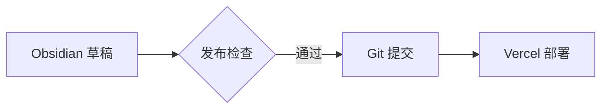

# 作者发布手册

网页后台、Obsidian 和普通 Git 编辑器操作同一个 GitHub 仓库。文章没有数据库副本：草稿、附件、版本和回滚都在 Git 历史中。进入 `main` 的提交由 Vercel 自动发布，不依赖 Codex。

## 方式一：网页后台

一次性配置见 [MIGRATION.md](./MIGRATION.md)。完成后：

1. 打开生产站 `/studio`；
2. 点击 GitHub 登录，仅在 GitHub 官方页面授权；
3. 选择“文章与 TIL”或“项目复盘”，创建条目；
4. 先填写稳定 slug，再上传封面或在正文插图；首次保存后该字段会显示 `Identity state / locked` 并变为只读。复制已有条目时必须在第一次保存前换成新的 slug。Studio 会在本地先检查真实格式、体积、宽高与动图总像素，再按目标路径和 SHA-256 对照已发布媒体清单以及本页面成功重放过的目标：新增文件直接通过，同路径同内容标为已发布/本次会话复用，同路径不同内容展示双方体积/摘要并要求明确确认。清单或 slug 不可信时图片不会进入草稿；取消或重放失败不会污染会话基线。快速连续选择时只有最后一次选择可以更新 Evidence Rail、进入草稿和登记会话摘要，旧检查晚到会静默丢弃，不会清空新文件。通过后才把原文件交给 Git 草稿，并显示格式/尺寸/帧数/体积/目标路径。图片直接保存到 `public/uploads/<slug>/`，正文写入 `/uploads/<slug>/...`；然后填写标题、摘要、内容语境、复核日期、标签和正文，历史记录选择 Historical，持续维护说明选择 Current；需要封面时同时填写不重复标题的“封面替代文本”；
   正文中的行内公式写成 `$...$`，独立公式用单独成行的 `$$` 包围；需要精确编辑定界符时切换到 raw Markdown 模式。普通正文继续使用 Studio 原生预览且不会请求公式接口；检测到公式后，`AUTHOR PROOF` 会显示 `FORMULA / CHECKING`，随后以生产站同一套 Markdown/KaTeX 规则给出 `FORMULA / VERIFIED`。语法错误会显示正文行号和 `FORMULA / NEEDS FIX`，同时保留原始 Markdown；预览网络不可用时也不会丢失正文或阻止保存草稿，最终发布仍由完整质量门判定。
   Author Proof 顶部的 `ENTRY CONTRACT` 会在停止输入后自动复检标题、slug、摘要、日期/时效、标签、草稿/精选、封面/替代文本、文章类型/专题/canonical 或项目状态/技术栈/地址以及正文。先看 PATH、VISIBILITY、CONTEXT、BODY 四格证据，再逐项处理 `NEEDS WORK`；`READY` 只表示当前条目字段可进入仓库检查，不代表已经发布。该预检只读且不会保存；专题连续性、媒体所有权、站内链接和完整构建仍在保存/发布后验证。若显示 `PREVIEW UNAVAILABLE`，草稿仍在编辑器中，可以稍后重试或先保存草稿。
5. 草稿阶段保持 `draft: true`，通过 editorial workflow 保存；
6. 预览并把状态推进到 Ready；
7. 发布后确认 GitHub 提交/PR、Quality Gate、Vercel Production 和在线文章全部成功。

### 发布本地静音 MP4

Studio 在正文工具栏选择“本地静音视频”，依次选择 MP4、填写短标题和详细画面说明；组件会写入当前 slug 的正式路径。Obsidian 草稿先把文件放进根暂存 `public/uploads`，并使用：

```markdown

```

约束：每篇最多 2 段；每段最多 12 MiB、90 秒、1920×1080；只允许 H.264/AVC、单一画面轨、无音轨/字幕轨/其他轨、普通非分片 MP4，并要求 fast start。正式内容必须位于当前内容 `/uploads/<slug>/`，不能使用外链、查询参数或 iframe；根暂存路径只允许出现在 Obsidian inbox 草稿中，并必须由发布器转换。标题和画面说明均必填。

Studio 会先检查扩展名、MP4 容器签名、体积、浏览器可解码时长/尺寸、SHA-256 和同路径冲突；保存后的构建门再用 MP4Box 验证编码、全部轨道、fragmented/progressive。浏览器通过不等于可以发布，以构建结果为准。Obsidian 会把根暂存的 Markdown MP4 归档到同 slug 目录，把正文改写为 `/uploads/<slug>/<file>.mp4`，保持文件字节不变并纳入既有回滚、提交和 push；Wiki `![[video.mp4]]` 因无法携带必填标题而会被正式契约拒绝，应改用上面的 Markdown 语法。封面仍只能是图片。

需要把有声素材发布为 v1 时，先在本地导出静音 H.264 fast-start MP4。不要只把文件改名为 `.mp4`；真实编码和轨道会被构建门解析。带声音的内容要等字幕/文字稿契约完成后再开放，不能通过关闭检查绕过。

### 发布本地 MP3 音频笔记

Studio 在正文工具栏选择“本地音频笔记”，选择 MP3，并填写标题、简述和完整文字稿。Obsidian 可从命令面板运行“插入本地音频笔记模板”；inbox 草稿先把文件放进根暂存 `public/uploads`，再使用：

```markdown
> [!audio] 发布复盘口述
> [下载 MP3](/uploads/release-retro.mp3 "发布复盘口述")
> 总结发布检查、上线确认与复盘结论。
>
> **文字稿**
> 先运行完整检查，再确认生产冒烟通过。
```

发布器会把根暂存 MP3 原子归档到 `/uploads/<当前 slug>/` 并改写正文；正式文章/项目必须直接引用当前 slug 目录。每篇最多 3 段，每段最多 8 MiB、15 分钟；只允许真实 MPEG Layer III、32–320 kbps、16–48 kHz、单声道或双声道。标题、单行简述和等价完整文字稿都必填，路径不能是外链、跨 slug、查询参数或锚点。

Studio 浏览器先检查 ID3/frame sync、文件大小、可解码时长、SHA-256 和同路径冲突；保存后的构建门再用 `music-metadata` 验证真实编码、码率、采样率和声道。浏览器通过不等于可以发布，以构建结果为准。读者端使用原生播放器，不自动播放；即使音频不可用，文字稿仍可阅读、搜索和打印。

不要在正文、字段或截图中保存 OAuth token。若后台显示未配置，检查 Vercel Production 的 `GITHUB_OAUTH_ID` 与 `GITHUB_OAUTH_SECRET`，不要把值复制到聊天。

### 在 Studio 查看内容复核队列

打开 `/studio/maintenance`，或点击 Studio 左下角的 `Content review / 复核队列`。页面只列出这个部署已经公开的 Current 内容：

- `HEALTHY`：距离最后有效日超过 60 天；
- `REVIEW SOON`：剩余 60 天以内，应该安排复核；
- `DUE SOON`：剩余 30 天以内，应该优先处理；
- `OVERDUE`：已经越过最后有效日，正式构建也会失败。

每条记录的 `Edit entry` 回到该 slug 的 Studio 条目，`Open evidence` 打开当前公开页面。复核页不会修改 `reviewedAt`、创建提交或发送提醒；编辑并发布后，要等新提交进入 Production，队列才会反映新内容。若队列暂时无法读取，使用页面内 `Retry`，或运行下方的 `npm run content:status` 取得同一规则的本地证据。

## 方式二：Obsidian

1. 在 Obsidian 选择“打开文件夹作为仓库”，打开项目根目录；
2. 打开命令面板运行“MyBlog Publisher: 新建博客草稿”，选择 Article、TIL 或 Project，填写标题和稳定 slug；
3. 插件从对应的 `templates/obsidian/*.md` 创建 `content/inbox/<slug>.md` 并打开；文件名是唯一 slug 身份，frontmatter 不再重复保存 `slug`。写作中途确需改名时保存笔记，再运行“重命名当前草稿”；
4. 图片可直接粘贴到 Obsidian；默认先进入 `public/uploads`，发布器会移动到 `public/uploads/<slug>/`、规范化带空格或中文的文件名，并重写 Wiki/Markdown 图片链接；需要封面时取消模板中 `cover`/`coverAlt` 的注释，cover 指向同一附件目录中的图片；静态 PNG/JPEG/WebP 自动优化为 WebP，GIF/AVIF 和动画 WebP 保持原文件；
5. 链接已有文章或项目时可以写 `[[note]]`、`[[note#标题|别名]]`、`[[projects/slug]]` 或相对 Markdown 链接；发布器会转换为稳定 `/posts/...`、`/projects/...` URL 和标题锚点，并在预检时确认目标标题真实存在；
6. 需要为判断补充证据时使用 Obsidian/GitHub 兼容脚注：正文写 `这个判断[^来源]`，文末写 `[^来源]: 证据说明与链接`；标识符只负责关联，不决定网页显示编号，同一脚注可以在正文引用多次；
   数学公式直接沿用 Obsidian 写法：行内公式使用 `$B_{\mathrm{client}}$`，独立公式使用单独成行的 `$$` 包围 LaTeX。普通金额中的美元符号写成 `\$`；代码示例放入反引号或围栏代码块。发布检查会用 KaTeX 解析每条公式，无法解析的命令或括号会标出正文行号并阻止发布；很长的独立公式在网页内可横向滚动，发布前仍应检查打印预览。
7. 选择 `freshness`：学习过程和阶段性方案通常用 `historical`，需要持续准确的项目/操作说明用 `current`；`reviewedAt` 填写本次确认事实的日期；
8. 先运行“查看当前草稿发布意图”，快速核对内容类型、公开目标、NOW/SCHEDULED 日期、附件数，以及站内链接的目标、源码行与重复次数；需要全库对照时再运行“查看全部草稿发布就绪状态”，处理 `blocked`；最后运行“检查当前草稿”；
9. 确认当前内容已经可以公开后，运行“发布当前草稿并同步 GitHub”；该命令会把 `draft` 改为 `false`，未来日期内容会保持计划状态；
10. 阅读预检摘要，确认目标路径、附件源/产物格式、宽高、帧数、体积变化、站内链接、内容语境和 frontmatter；
11. 发布器运行完整质量门、创建内容提交并 push `main`；Vercel Git 连接完成后会自动上线。若团队改用 PR 流程，则不要运行同步命令，改由普通 Git 客户端创建分支和 PR。
12. MyBlog Publisher 1.42.0 会先确认运行代码、runtime manifest 和磁盘插件版本一致，验证三个插件文件的 bundle 摘要，并证明 bundle 与三个目标文件均由 Git HEAD 跟踪、index 相等且 worktree 未修改；推送成功后再校验 Git 交付证据、释放可能存在的写事务并完成 Vault reconcile，自动等待该篇正式内容上线。push 失败后使用两条“重新同步待交付…”恢复成功也会自动接力。只在使用网页或普通 Git 时，才手动打开正式笔记运行“等待当前正式内容上线”。需要核对全库时运行“检查生产内容同步状态”。

### 用受信模板新建一个 inbox 草稿

MyBlog Publisher 1.30.0 的新建命令只接受 `article / til / project`、1–120 字符单行标题和 1–80 字符小写 ASCII slug。它从固定 Vault 路径读取模板，验证唯一空标题、三个日期占位符、draft/featured、类型特征，并拒绝任何重复的 frontmatter `slug` 或未知占位符；再用 YAML 安全双引号标题与 `Asia/Shanghai` 当天渲染。写入前会两次检查 `content/inbox|posts|projects/<slug>.md`，最终由一次 `vault.create` 排他创建；不会覆盖任何已存在内容。

Modal 同步锁定提交按钮，因此双击只触发一次；另一个 Modal 或同步程序抢先创建时，后到请求显示错误且不改文件。输入或模板问题保留 Modal 供修改。文件创建成功后才尝试打开：若打开失败，文件仍保留，Notice 会给出精确路径；不要再次创建同 slug。该入口不启动 npm/doctor，不移动附件、不发布、不暂存、不提交、不推送、不访问网络。完成正文后仍按步骤 8 运行 inbox 总览和当前草稿检查。

### 安全重命名一个未发布草稿

保存当前笔记后运行“MyBlog Publisher: 重命名当前草稿”。命令只在桌面端活动文件精确匹配 `content/inbox/<lowercase-ascii>.md` 时可用。Modal 用 `CURRENT → TARGET` 展示身份变化；新 slug 必须不同、最多 80 字符且符合小写 kebab-case。插件在任何磁盘读取前检查 inbox/posts/projects 三命名空间，随后用 Vault `read` 读取直接内容、解析 frontmatter 并要求 `draft: true`、不存在顶层 `slug`；执行前再次检查路径与来源文件身份。

通过后插件只调用一次 Obsidian `FileManager.renameFile`，不改正文。Obsidian 是否同步更新内部链接取决于作者的链接设置。多个改名 Modal 由独立 lease 串行化，同一 Modal 的重复点击也只进入一次。旧式草稿先使用下面的身份检查，不要直接猜测删除。宿主拒绝改名或返回后无法同时证明旧路径消失、新路径精确存在时，结果标为不确定，并提示检查两个路径；不要立即重试，也不要手工复制出第二份文件。该入口不运行子进程、Git、发布或网络。

### 检查和清理一个旧式草稿身份

保存活动 inbox 草稿后运行“MyBlog Publisher: 检查当前草稿身份”。原生证据页以 `FILE ⇄ FRONTMATTER` 展示两个身份来源，并列出 `DRAFT / INBOX / POST / PROJECT`。`READY / FILE OWNED` 无需动作；`HOLD / CONFLICT` 只给原因；只有 `LEGACY / MATCHED` 才允许“移除冗余 slug”。

允许清理必须同时满足：安全文件名、`draft: true`、posts/projects 无同名内容、顶层 YAML 字符串等于文件名，且原始行精确为无引号、注释或 anchor/tag 的 `slug: <filename>`。插件在一次 `Vault.process` callback 中比较最新正文与检查时字节，再只删除该行；随后重新读取并证明全部其他字节不变。格式歧义、内容变化、宿主拒绝或后置证据不足都不会重试。清理完成后再运行“重命名当前草稿”或既有发布检查；身份检查本身不发布、不提交、不联网。

### 查看当前草稿的作者意图摘要

保存活动 inbox 草稿后运行“MyBlog Publisher: 查看当前草稿发布意图”。插件 1.30.0 会冻结当前安全 `TFile`，运行 `npm --silent run content:inbox -- --format json --source content/inbox/<slug>.md`，严格验证 version 5、`mode: read-only`、四项 false 安全声明、唯一 entry/媒体/issue、状态日期与聚合计数，并要求精确同路径。`DRAFT → PUBLIC` 显示 inbox 到 posts/projects 的目标，`TYPE / DATE / MEDIA / LINKS` 显示 Article/TIL/Project、NOW/SCHEDULED、附件数与唯一精确站内目标数；`MEDIA TRACE` 显示可点击的 `ALT · L<n> · AUTHORED/FILENAME FALLBACK`、最终替代文本和媒体变换，`LINK TRACE` 显示 POST/PROJECT/SELF、最终公开路径、重复次数与每次可点击的 `REF · L<n>`。空或纯空白文本保留为 `EMPTY · WILL FAIL` 并以 `attachment-alt-empty` 阻塞；无 display/仅尺寸 Wiki 图片保留最终文件名文本、标为 `FILENAME FALLBACK · WILL FAIL`，并以 `attachment-alt-filename-fallback` 阻塞。blocked 追加其余问题证据。

`MEDIA TRACE` 不读取图片，而是消费 readiness 已有的 preparation 与 `usages`。发布器在既有 cover 注册和正文 Wiki/Markdown 图片转换中聚合 COVER/BODY、出现次数与来源行；正文同一行的重复引用会保留重复行号。插件要求角色唯一且顺序固定、cover 恰好一次、行号数量与 occurrences 相同且为正序正整数；同时继续要求 source/target 路径唯一且与 inspection 对齐，格式匹配扩展名，`bytesSaved` 等于输入减输出。preserved 必须格式、尺寸、帧数和字节完全稳定，optimized 只接受单帧 JPEG/PNG/WebP 到单帧 WebP 且不得放大。ready/scheduled 附件没有 preparation 会失败关闭；blocked 的 unproven 附件必须有同来源 missing/invalid issue。媒体变换与链接目标本身保持只读；只有 ALT/REF 标签定位本地来源行。

摘要不在插件中重写 Markdown/YAML 或链接解析，而是复用发布器和 inbox readiness。唯一目标、源码行和出现次数来自同一 AST 遍历与原目标/标题验证循环；正文替代文本及 `authored|filename-fallback` 也在既有 Wiki/Markdown 图片归一化回调构造最终 `` 时记录，封面文本读取已通过正式 Zod 契约的 `coverAlt`。插件继续严格核对所有数组、来源和 blocker；详情页与知识地图使用原兼容投影。ALT 与每个 LINK occurrence 把封闭的 evidence kind 和一基行号传给同一守卫：重新验证冻结/活动 inbox 路径、原 `TFile` 与 Vault 映射，用 `vault.read` 检查磁盘行界；打开后只接受同文件的活动 `MarkdownView`，再验证 Editor 行数、设置 cursor、滚动并聚焦。路径或身份在异步读取中漂移、越界、错误视图、重复点击或打开失败都保持 Modal。成功才关闭；该动作不修复内容、不启动 doctor/事务 lease/发布/Git，也不联网。`READY / PUBLIC ON PASS` 仍只代表本地摘要证据，必须另行运行“检查当前草稿”与完整发布门。

命令行等价操作：

```bash
npm run content:publish -- content/inbox/learning-vercel-deployments.md --check-only
npm run content:publish -- content/inbox/learning-vercel-deployments.md --push
```

`--check-only` 会在仓库同盘的忽略 staging 中完成真实媒体处理，验证 frontmatter、目标路径、正文附件、cover、站内页面与目标标题锚点，并列出每个附件的归档路径和源/产物差异；随后删除 staging，不修改文件。省略标志会关闭草稿状态、原子归档已验证附件、把 Obsidian 链接与 cover 转换为稳定站点 URL、生成正式内容并运行完整检查，但不提交；完整检查还会确认正式图片 URL 精确存在、归档目录与内容 slug 一致且没有孤立文件。如果检查失败，草稿与全部附件会按原路径、原文本和原字节恢复。`--push` 在同一流程通过后只暂存目标内容、受跟踪的源文件删除和归档附件，创建提交并推送 `main`。运行 `--push` 前应确认暂存区为空。

### 任何 push 失败后先做统一分诊

先运行“MyBlog Publisher: 查看 Git 交付恢复”；命令行等价为：

```bash
npm run content:delivery:status
npm run content:delivery:status -- --format json
```

MyBlog Publisher 1.30.0 只读取一次当前分支、本地 main、最后观察到的 origin/main 和 ahead/behind，再用同一观察验证复核与新内容发布身份。`DELIVERY SWITCHYARD` 只会命中 `REVIEW`、`PUBLICATION`、`INSPECT` 三条轨道之一；synchronized 则不提供后续命令。exact route 会列出对应的既有 status 和 deliver 命令，但分诊不会自动执行它们，也没有动作按钮。非 main 保留类型证据但锁定 deliver；任何不一致或不可信 JSON 都只降级为纯文本，不 fetch、push、rebase、reset 或改写工作区。

### 在 Obsidian 查看待同步新内容发布

如果 `--push` 已创建 `content: publish <slug>` 但提示 push 失败，不要恢复 inbox、复制草稿或再次运行发布。统一分诊显示 `PUBLICATION / MATCHED` 后，再运行“MyBlog Publisher: 查看待同步新内容发布”，命令行等价为 `npm run content:publish:status`；JSON 证据增加 `-- --format json`。MyBlog Publisher 1.30.0 只读取本地 main、最后观察到的 origin/main 和 HEAD commit，不 fetch、不 push、不写文件。只有 ahead 1 / behind 0、单父级等于 tracking head、subject 与 slug 一致，且 commit 变更精确等于一个新增正式 Markdown、可选同 slug inbox 删除和零到多个同 slug 归档媒体新增，才显示 `PUBLICATION HOLD / ATOMIC BUNDLE`。

结构化 Modal 用 `COMMIT ENVELOPE / N PATHS` 依次列出 `NOTE / ADDED`、`MEDIA nn / ADDED`、`INBOX / DELETED`，并保留 commit/tree/target blob 和 `git push origin <verified-oid>:refs/heads/main`。只读证据确认无误后，单独运行“MyBlog Publisher: 重新同步待交付新内容发布”；命令行等价如下：

```bash
npm run content:publish:deliver
npm run content:publish:deliver -- --format json
```

执行器不接受路径或 commit 参数：它从当前 main 再次读取同一个 exact pending-publication，固定 index/worktree 和完整 Commit Envelope，二次核对后只把已验证 OID 以普通非强制 refspec 推向 `origin/main`。服务器拒绝或远端抢先推进时，本地发布提交与 envelope 保持不变；错误分支、普通 ahead、复核提交、额外路径、旧媒体修改、堆叠提交或执行前漂移都会在 push 前失败。成功后 Modal 显示 `PUBLICATION RECEIPT / SEALED ENVELOPE`、同一 NOTE/MEDIA/INBOX 清单、commit/tree/target blob、精确 refspec，以及 `HEAD / INDEX / WORKTREE / MANIFEST STABLE`。回执只证明 Git 送达，Vercel Production 仍由独立检查确认；成功输出不可信或 postcondition 不完整时不会自动重试，而是要求重新运行只读状态。发布器自己也会在读取源草稿前检查同一状态，任何非 synchronized 关系都阻止第二次 `--push`。

全部草稿的命令行总览：

```bash
npm run content:inbox
npm run content:inbox -- --format json
npm run content:inbox -- --date 2026-08-05
npm run content:inbox -- --format json --source content/inbox/my-draft.md
```

默认命令逐篇给出 `ready`、`scheduled` 或 `blocked`，并展示内容类型、draft 状态、公开日、目标路径、真实媒体候选和结构化阻塞原因。`--source` 只接受精确安全的 inbox Markdown 路径：仍轻量检查全部草稿以保留共享附件与碰撞证据，只为目标 entry 派生真实媒体并返回一条重算 counts 的报告；目标不存在时失败。一个坏草稿不会中止其他草稿；blocked 只进入报告，不改变命令退出码。两种模式都不移动附件、不改写 Markdown、不提交、不推送；`ready` 也不替代单篇检查和正式发布时的完整质量门。因为本地未跟踪草稿不会出现在 GitHub 检出中，该报告只集成本地 `release:check` 和 Obsidian，不伪装成 Actions 的完整作者工作区视图。

### 在 Obsidian 查看已发布内容复核台账

打开命令面板并运行“查看已发布内容复核台账”。MyBlog Publisher 1.30.0 会在仓库根目录隐藏运行 `npm --silent run content:status -- --format json`，验证版本化报告后，用原生 deadline ledger 显示报告日期、Current/Historical/未公开数量、healthy/review-soon/due-soon/overdue 四档计数、源笔记路径、review-by、剩余天数和复核清单。每条记录的“打开笔记”只打开 Vault 中精确存在的 `content/posts|projects/<slug>.md`。该命令不读取网络、不修改 `reviewedAt`、不保存文件、不提交也不推送；它和 Studio 队列、每周 Actions 复用同一维护规则。

检查期间的持续 Notice 会在成功、降级、失败或插件卸载时关闭。维护 CLI 用退出码 1 表达“存在逾期内容”时，插件仍会展示通过 schema 的结构化报告；JSON、schema、安全路径或 UI 渲染不可信时，插件自动再读一次纯文本报告，而不是打开半可信交互。命令无法启动时仍只显示诊断；可在仓库终端运行 `npm run content:status` 取得完整输出。仓库更新了插件版本而 Obsidian 已经打开时，需要重启 Obsidian，或先关闭再启用 MyBlog Publisher，才能加载 1.30.0 代码。

### 在 Obsidian 核对生产内容同步

打开命令面板并运行“检查生产内容同步状态”。MyBlog Publisher 1.35.0 会隐藏运行 `npm --silent run content:production -- --format json`：先按 `Asia/Shanghai` 当天从本地正式内容生成目标生产 origin 的期望清单，再以 10 秒超时、1 MiB 上限、禁止自动重定向的 GET 读取真实 `/content.json`。只有 HTTP 200、JSON MIME、响应 SHA-256 ETag、有效 Last-Modified、严格 version 1 字段、同源 URL、稳定路由、逐项强 Markdown ETag、唯一 id 和稳定排序全部成立，才进入比较。

原生只读台账按 id 对齐内容：相同公开字段和 ETag 为“已上线”；同 id 但 Markdown ETag 或清单字段不同为“待部署”；本地有而生产没有为“生产缺失”；生产有而本地没有为“生产多出”。每项保留本地 Vault 路径、生产 URL、两侧 ETag 与差异原因；总览同时固定本地公开日期、生产清单响应 ETag 和 Last-Modified，便于证明比较的是哪一次生产快照。该命令只读本地正式 Markdown 并访问公开清单，不改文章、不暂存、不提交、不推送，也不执行部署。

网络超时、非 200、重定向、错误 MIME、超限正文、无效 JSON 或协议漂移属于“检查未完成”，不会伪装成待部署/缺失/多出；不可信的 CLI JSON 也不会打开 Modal、改读第二次网络或自动重试。命令行等价操作如下：

```bash
npm run content:production
npm run content:production -- --format json
npm run content:production -- --fail-on-drift
```

`--origin` 只接受 HTTPS origin；测试夹具可使用 HTTP loopback。`--date` 固定本地公开范围，`--timeout-ms` 接受 500–30000。该实时检查有意不进入 `release:check` 或 GitHub Actions：网络、代理、限流和 CDN 暂时不可达只能表示当前无法取证，不能阻断一份本地正确的提交。仓库更新后 Obsidian 已经打开时，重启 Obsidian，或先关闭再启用 MyBlog Publisher，才能加载 1.35.0 命令。

### 自动接力或手动等待当前正式内容上线

MyBlog Publisher 1.42.0 从正常发布/复核或两条“重新同步待交付…”恢复命令得到可信成功结果后，会自动继续等待生产上线。交付脚本只在 Git local/tracking 都证明同一个 commit 已送达后输出 version 1 handoff；它冻结最终正式来源、commit、原始 SHA-256、公开 id/标题/URL 与 Markdown ETag，并明确生产尚未检查、等待尚未开始。恢复命令先生成原 sealed receipt，再从其中的 commit blob 而不是可变工作区派生 handoff；插件要求两者 commit、交付类型和目标严格一致。插件必须先释放可能存在的作者事务，再等待 Vault reconcile 完成，随后才启动原只读等待器。因此三分钟网络等待不占用 Git 写锁；交付已经完成后出现 timeout、网络/协议错误、取消或插件卸载，也不会回滚、重新提交、重复 push 或自动重试。

使用网页 Studio 或普通 Git 时，在 Obsidian 打开精确的 `content/posts/<slug>.md` 或 `content/projects/<slug>.md`，运行“等待当前正式内容上线”。手动入口会现场冻结相同目标。手动与自动入口都以默认三分钟总时限、五秒间隔和十秒单请求时限等待该 id 在稳定生产 `/content.json` 中变为 deployed。持续 Notice 显示当前尝试、待部署/生产缺失状态和剩余秒数；成功或合法超时打开只读回执。自动入口额外显示 `DELIVERY HANDOFF / PUBLICATION|REVIEW` 与精确 commit。

第二次请求开始使用上一份可信清单 ETag 发出 `If-None-Match`；只有验证器和 Last-Modified 都严格成立的 304 才复用快照。pending 与 missing 表示继续等待；任何生产多出、响应/协议错误、活动来源字节漂移都会立即失败，绝不把错误改写成“还没部署”。同一命令再次运行时只保留最新一轮，旧进程和旧结果静默取消；关闭插件也会取消在途等待。命令不修改笔记、不运行 Git、不提交、不推送、不触发部署，也不会在失败后自动重试。

终端等价操作如下：

```bash
npm run content:production:wait -- --source content/projects/myblog.md
npm run content:production:wait -- --source content/posts/example.md --format json
```

可选参数包括 `--origin`、`--date`、`--timeout-ms`、`--interval-ms` 与 `--request-timeout-ms`。`--expected-source-sha256` 和 `--expected-local-etag-sha256` 是自动 handoff 使用的成对冻结参数，日常手动运行不需要填写；它们只接受无引号的 64 位小写十六进制值，适合 Windows 固定参数调用。退出码 `0` 表示 deployed，`2` 表示在合法时限内仍 pending/missing，`1` 表示输入、handoff、来源、生产或协议失败，`130` 表示取消。该命令依赖真实网络，不进入本地发布硬门或 Actions；仓库更新后 Obsidian 已经打开时，需要重启 Obsidian，或关闭再启用 MyBlog Publisher，才能加载 1.42.0。

### 在 Obsidian 完成正式内容复核

复核不是自动更新时间戳。先从台账打开正式文章或项目，逐项核对正文中的版本、架构、项目状态、命令和链接：无事实变化时只把 `reviewedAt` 改为上海当天；有正文或元数据变化时，同时把 `updatedAt` 和 `reviewedAt` 改为当天。不要改变 `publishedAt`，Historical、draft 或未来内容不进入该流程。

保存笔记后运行“MyBlog Publisher: 检查当前正式内容复核”。MyBlog Publisher 1.30.0 会先自动运行 author doctor；只有 ready 才要求 `main`、本地 main 与最后观察到的 origin/main synchronized、目标已被 Git 跟踪且暂存区完全为空。工作区除目标外，可以保留稳定的 inbox 草稿和未跟踪根图片。完整 `npm run check` 前后使用同一个 impact classifier 重算，并要求 HEAD、tracking 关系与目标原始字节的 SHA-256 不变。成功 Proof 会显示 `CANDIDATE / GATE-STABLE` 短指纹，把并行工作列为 `DEFERRED / NOT IN COMMIT`，并继续显示日期迁移、事实变化、updatedAt、质量门和唯一可提交路径。已跟踪根媒体、嵌套归档媒体、其他正式内容、代码或未知路径不会 deferred，而会直接阻断。确认后运行“提交并同步当前正式内容复核”，它再次先运行 doctor，再执行同样门禁；只暂存该 Markdown，核对 index 与提交 tree 的 Git-clean blob 后以 `content: review <slug>` 提交并推送 `origin main`，并行草稿保持原状态。

如果最后一步提示 push 失败，不要再次提交复核。先由统一分诊确认 `REVIEW / MATCHED`，再运行“查看待同步正式内容复核”；只有 rail 仍证明同一个精确 pending-review 时，才运行“重新同步待交付正式内容复核”。该命令调用 `content:review:deliver`，以已验证 commit OID 作为 push 源，不接受路径或分支参数。服务器拒绝、远端抢先推进、错误分支和本地状态漂移都会失败并保留提交；成功后弹出的 sealed receipt 必须同时列出相同的 local/tracking OID、commit/tree/blob、精确 refspec 与 HEAD/INDEX/WORKTREE STABLE。回执只证明 Git 交付；插件另行校验同 commit handoff、reconcile Vault 并启动 Production 等待。任一证据解析失败都不会自动再推一次，可改用手动等待。

命令行等价操作如下：

```bash
npm run content:review -- content/projects/my-project.md --check-only
npm run content:review -- content/projects/my-project.md --check-only --format json
npm run content:review -- content/projects/my-project.md --push
```

`--format json` 只允许和 check-only 组合；它在完整门通过后输出 `version: 3` 的 candidate/review/git/qualityGate 证据，质量门日志不会混入 stdout。candidate 必须是 `sha256`、64 位小写摘要且明确声明门前/门后稳定；git 段的 changed 除目标外只能是已修改 inbox，untracked 只能是 inbox 或支持格式的根图片，两者并集必须精确等于 deferred，staged 必须为空且 committable 只能是目标。原始 SHA-256 证明质量门实际读取的工作区字节未变；Git blob OID 则通过 `hash-object --path` 纳入 `.gitattributes`/行尾 clean filter，分别与 index 和 tree 核对。由于日期精度为一天，已经在当天复核过的内容不能再次声明新的复核；同日后续事实修正仍可用普通 Git 流程提交，但不要伪造第二次复核。全量门、HEAD、tracking 关系或候选漂移时文件保持未暂存；commit 前失败会取消目标暂存；hook 令提交 tree 漂移时会原子撤回该提交并保留工作区。若候选已验证而 push 失败，本地提交会保留；运行 `npm run content:review:status` 或 Obsidian“查看待同步正式内容复核”，确认 `PENDING / NOT ON TRACKING REF` 后按显示命令恢复，不要重新运行复核命令制造重复提交。报告不 fetch，origin/main 只代表最后一次本地观察。

## 迁移已公开 URL

正常发布不要修改 slug。确需迁移时使用普通 Git 分支一次完成以下事项：

1. 移动 Markdown 文件并同步修改 frontmatter slug；
2. 将 `public/uploads/<旧 slug>/` 移到新 slug，并更新 cover、正文图片、站内链接和引用；
3. 在 `content/redirects.yml` 增加旧 URL 到最终新 URL 的记录，填写当天 `addedAt` 和清晰的 `reason`；
4. 直接指向最终公开页面，不把旧地址串成多跳链；
5. 运行 `npm run check`，合并后再确认旧地址返回 308 且 `Location` 是新地址。

注册表中的 `/blog -> /posts` 是可运行示例。不要为草稿、未来内容、静态附件、Studio/API 路径建立重定向，也不要移除仍有外部访问或搜索索引价值的旧地址。若误配，回滚对应 Git 提交即可恢复上一版路由表。

## 本地图片预算

| 检查 | 上限或规则 |
| --- | --- |
| 文件类型 | PNG、JPEG、WebP、GIF、AVIF；扩展名必须匹配真实解码格式 |
| 单文件体积 | `≤ 3 MiB` |
| 单帧宽高 | 各 `≤ 2560 px` |
| 单帧像素 | `≤ 8,000,000` |
| 动图总像素 | `宽 × 高 × 帧数 ≤ 80,000,000` |

Obsidian 的静态 PNG/JPEG/WebP 原图可以在发布前暂时超过公开预算，但不得超过 25 MiB、8192×8192 px 或 4000 万像素的安全包络；发布器会自动校正方向、等比缩放并生成 WebP，产物仍必须通过上表。GIF、AVIF 和动画 WebP 不自动重编码，输入本身必须符合上表。网页 Studio 会在本地拒绝不支持或伪装格式、损坏文件、超体积/尺寸/像素预算的图片，并计算 GIF、WebP 与 APNG 帧预算；动画 AVIF 需要先转换为静态 AVIF/WebP 或改用 Obsidian。随后它从稳定 slug 和规范文件名显示最终仓库路径，并先查本页面成功重放的内存基线、再查同源已发布清单：same/same-session 可以继续，replace-risk/replace-session-risk 只有明确确认才继续。会话基线不持久化，刷新页面后重新以生产清单为准。为与固定 Decap ASCII 命名保持确定，Studio 文件名使用英文、数字、连字符或下划线；无法稳定转换的非 ASCII 名称会要求先重命名。Studio 保留原始字节，JPEG/PNG 若需要自动缩放转 WebP，请改用 Obsidian 发布器。`next dev`、`next build` 和 GitHub Quality Gate 会重新递归校验 `public/uploads` 及正式内容引用，所以普通 Git 编辑器也不能绕过门禁。不要只改扩展名。

## 内容维护报告

随时运行：

```bash
npm run content:status
npm run content:status -- --format json
```

报告只列出已经公开的 Current record，显示最近复核日、最后有效日和剩余天数；Historical snapshot、草稿和未来内容不进入队列。剩余 60 天进入复核窗口，剩余 30 天标为即将到期，第 180 天仍可发布，第 181 天报告与构建失败。GitHub Quality Gate 每次提交和每周一 09:00（Asia/Shanghai）自动生成同一份可勾选摘要，预警直接标注到源 Markdown，但不会在到期前阻断发布。

复核时逐项检查架构、版本、项目状态、操作步骤和关键外链；事实变化时更新正文与 `updatedAt`，全部确认后再更新 `reviewedAt`。不要只改日期绕过复核。

## 根暂存附件报告

Obsidian 粘贴的图片在发布前位于 `public/uploads` 根目录。随时运行：

```bash
npm run media:staging
npm run media:staging -- --format json
npm run media:staging -- --date 2026-08-05 --stale-days 30
```

报告按路径列出体积、Git 状态、最近变化日期、引用它的 `content/inbox` 草稿和处理建议，并区分单草稿引用、多草稿共享、未引用、缺失引用与无法审计的草稿。干净且已跟踪的文件使用 Git 最后提交日期；未跟踪或本地已修改文件使用明确标注的 filesystem 日期，所以不会把本地观察伪装成 Git 历史。默认 30 天标为陈旧，只用于提示草稿可能已搁置。

Quality Gate 每次提交和每周维护都会把同一库存写入 Actions summary，并为共享、未引用、陈旧、缺失或无法解析的条目创建 warning。报告始终返回成功（扫描本身失败除外），也不会自动删除文件。删除前应先打开列出的草稿确认引用；多草稿共享时先为每个内容复制独立附件，再分别发布。

## 外部链接库存与健康检查

发布前可运行 `npm run links:external` 查看公开正文普通 HTTPS 链接以及 `canonical`、`repository`、`demo` 结构化端点。正文 occurrence 显示相对行和链接标签，字段 occurrence 显示 `frontmatter.<field>`；相同规范 URL 会合并但不会丢失出现次数。默认模式完全离线，只读 Markdown，不会请求第三方或改写内容；`release:check` 会输出同一库存。HTTP、协议相对、无法解析和含凭据正文地址会作为本地 issue 列出，凭据本身不会出现在报告。

需要当前网络证据时显式运行 `npm run links:external -- --check`。检查器只发送 HEAD 并立即关闭响应，逐跳限制 HTTPS/443、公网 DNS、重定向、并发、超时与重试；它不会用 GET 下载正文，也不会自动替换链接。404/410 等确定问题可人工修正；403/429、目标不支持 HEAD、5xx、超时或网络错误只表示当前自动检查不足，应在普通浏览器和另一网络路径复核。只有作者明确增加 `--fail-on-broken` 才让确定 broken/本地 issue 返回非零，实时检查不进入 GitHub Actions。

## 在正文中使用 Callout

Studio 与 Obsidian 都直接写标准 blockquote 形式，不需要插入 HTML：

```markdown
> [!info] 为什么这样做
> 这里写证据、列表、链接、脚注或公式。

> [!warning]- 发布前检查
> 这段内容默认收起。

> [!tip]+ 可复用经验
> 这段内容默认展开。
```

第一行格式为 `> [!类型][可选 + 或 -] [可选标题]`。无 `+/-` 时始终展开且不可折叠；`+` 默认展开、`-` 默认收起，读者仍可用鼠标或键盘切换。可用类型：`note`、`abstract`、`info`、`todo`、`tip`、`success`、`question`、`warning`、`failure`、`danger`、`bug`、`example`、`quote`。Obsidian 的 summary/tldr、hint/important、check/done、help/faq、caution/attention、fail/missing、error、cite 等官方别名也可使用。

Callout 可以嵌套，也可以包含普通 Markdown；嵌套时每层都要继续带 `>`。不要用 raw HTML、iframe、任意 class 或 CSS。自定义标题是纯文本，不要依赖标题中的强调或链接。需要展示 Callout 写法本身时放进 fenced code block。普通引用继续只写 `>`，不会变成信息块。

Studio 预览状态现在以 `RICH MARKDOWN` 开头；`VERIFIED` 会分别报告公式、信息块与图表数量。`FORMULA / NEEDS FIX` 表示公式语法无法通过 KaTeX，`DIAGRAM / NEEDS FIX` 表示 Mermaid 类型、语法、安全策略或资源预算不通过；Callout 标记不合法时仍作为普通引用安全降级。`PREVIEW UNAVAILABLE` 不会删除正文，可以稍后重试；正式构建会再次用同一生产管线检查。

## 在正文中使用 Mermaid 图表

Studio 与 Obsidian 都直接写 `mermaid` fenced code，不需要导出图片、插入 HTML 或加载浏览器端 Mermaid：

````markdown

````

当前支持六类语法：`flowchart`/`graph`、`stateDiagram-v2`、`sequenceDiagram`、`classDiagram`、`erDiagram`、`xychart-beta`。发布时由 Node 服务端把源码编译为 SVG，移除上游内嵌样式与外链，再通过独立 HAST 白名单清理；读者不会下载 Mermaid 运行时。图表保留 `DIAGRAM / TYPE` 与 `SERVER SVG` 证据轨道，宽图只让画布横向滚动，下面的“MERMAID SOURCE / 查看源码”可展开原始源码；打印保留 SVG、隐藏重复源码。

为保证构建和阅读安全，每篇最多 8 张图；单张源码最多 8192 字节、160 行、单行 500 字符，单张 SVG 最多 240000 字节/1800 个元素，全文 SVG 总量最多 800000 字节。不要使用 `%%{init}`、`click`、`style`、`classDef`、`linkStyle`、`:::`、raw HTML、`javascript:`/`data:` URL 或 CSS `url()`。需要自定义颜色时不要写进图表源码；深浅色和打印主题由博客统一控制。错误会显示 fenced code 所在正文行，修正后 Studio 会自动重新预览。

图表节点文字仍会进入现有搜索纯文本，公开 `source.md` 保留原始 Mermaid fence，因此 Obsidian 与仓库之间可以继续 round-trip。当前没有支持 mindmap、gantt、pie、Git graph、C4、Sankey、自定义图标、点击跳转或任意主题扩展；这些能力必须分别证明解析、安全、无障碍、资源和打印边界后才能加入。

## 内容字段

所有内容共有：`title`、`description`、`publishedAt`、`freshness`、`reviewedAt`、`tags`、`draft`、`featured`、可选且成对出现的 `cover`/`coverAlt` 和正文。文章额外有 `type`、可选 `series`/`canonical`；项目额外有 `status`、`stack`、可选 `repository`/`demo`。详细契约见 [CONTENT_MODEL.md](./CONTENT_MODEL.md)。

## 发布前自检

环境变化后可单独运行“MyBlog Publisher: 检查本机发布环境”，或执行：

```bash
npm run content:author:doctor
npm run content:author:doctor -- --format json
```

MyBlog Publisher 1.42.0 把 13 项基础检查、第 14 项插件 bundle 摘要与第 15 项 Git provenance 画成 `RUNTIME → GIT → WORKSPACE → VAULT → AUTHOR READY/HOLD` 的只读 preflight circuit。四个新事务——检查/发布当前草稿、检查/提交当前正式内容复核——都会自动先运行同一 JSON doctor：ready 无中间弹窗并进入原命令；attention 显示 `TRANSACTION INTERLOCK / HELD`、被冻结的操作/来源路径与修复证据，且不启动领域命令；不可信 JSON 降级纯文本后失败关闭。当前草稿作者意图摘要及其 ALT/REF 本地导航不属于写事务，继续绕过这条 lease。

每个 Git 写入口还要完成三方版本握手：插件内嵌的运行代码版本、Obsidian 提供的 runtime manifest 版本、doctor 从仓库磁盘读取的 manifest 版本必须完全相等。磁盘已经出现更新的 patch/minor 版本时，旧运行时仍能严格解析证据，但只显示无按钮的 `PLUGIN RELOAD REQUIRED`，列出三份版本并要求关闭再启用插件或重启 Obsidian；不会自动重载，也不会启动发布、复核或恢复 Git 命令。两条 recovery deliver 仍不占用作者事务 lease，并且只把 doctor 用作版本预检：Git 身份、local ahead 等非版本 attention 不阻断恢复，但版本身份缺失、不可信或漂移都会失败关闭。

`bundle.json` 不把自身放进摘要清单，避免自引用；它按固定顺序声明 `main.js`、`manifest.json`、`styles.css` 的 SHA-256、插件 id/version 与 contract version。修改任一插件文件后运行 `npm run plugin:bundle -- --write`，再用不带 `--write` 的同一命令验证。缺失文件、符号链接、未知 descriptor 字段、局部同步或摘要漂移显示无按钮 `PLUGIN BUNDLE INVALID` 与每个文件的 expected/observed 短摘要；插件不会自动生成、覆盖或重载。

摘要验证通过后，v3 doctor 还会对 `bundle.json/main.js/manifest.json/styles.css` 分别读取 HEAD blob、index blob，并检查 staged/unstaged 状态。任一路径未跟踪、HEAD/index 不同、index 或 worktree 改动、Git 证据不可用时显示无按钮 `PLUGIN PROVENANCE UNVERIFIED`，列出每个路径的短 OID 与状态。插件不会自动 add/commit/push/fetch/reset；请先审阅差异，通过正常 Git 工作流恢复或提交并同步四个路径，再重载插件。legacy `--format json` 保持 13 项 v1，显式 `--plugin-bundle` 保持 14 项 v2；1.41 插件固定请求 `--plugin-provenance` 的 15 项 v3，默认文本也使用 v3。

四个事务由同一个 single-flight lease 串行化。租约覆盖 doctor、领域命令以及 author/review 纯文本降级，并记录 `preflight / domain / diagnostic` phase、不可重置的 startedAt、phaseEnteredAt 与 owning child 的 lastOutputAt。运行“查看当前作者事务”会在 ACTIVE 时显示 operation、sourcePath、阶段进入/用时、最近 stdout/stderr/静默时长和总开始/用时；占用期间再次调用新事务用完全相同的快照显示 `AUTHOR TRANSACTION / BUSY`，不排队、不启动第二条命令链。换阶段或换 child 会清空前一阶段的输出活动；只有当前 lease + child 能更新时间，旧进程的迟到输出不会污染新阶段，正文达到捕获上限后 activity 仍记录。快照按查询时钟派生且冻结，duration 遇时钟回拨钳制到零，不持续刷新；静默不分类为 healthy/stuck，不触发 timeout、watchdog、取消或重试。

最终 owner 结算时，1.18.0 再冻结一条只驻留当前插件会话的 receipt：operation、sourcePath、final phase、startedAt、endedAt、elapsed 和六类 outcome。空闲查询显示 `IDLE · LAST RECEIPT`；新事务 ACTIVE 优先，旧 lease/child 的迟到事件不能覆盖后来回执。`HELD` 表示原操作被 author preflight 或不可信 doctor 证据阻断，其他失败按 command/start/result 分开；回执不保存 stdout/stderr 正文、错误详情、退出码、PID 或 Git identity，重载插件即清空。它不是 deliver receipt，也不执行恢复动作；push 结果不确定仍使用统一 Git 交付分诊。显式 doctor、只读报告、统一分诊、状态检查与两类待交付 deliver 有意绕过租约，确保作者仍可诊断和恢复。

- slug 是小写 ASCII、数字和连字符，首次发布后不修改；
- 标题和摘要能独立说明读者所得；
- 标签来自 Studio/契约注册表；
- `updatedAt` 不早于 `publishedAt`；
- `reviewedAt` 不早于 `updatedAt`/`publishedAt`，也不写未来日期；
- Historical snapshot 明确说明记录时间和当前去向；Current record 已逐项复核地址、版本、状态和操作说明；
- 正文外链与 canonical/repository/demo 使用 HTTPS，不含用户名/密码或协议相对地址；运行 `npm run links:external` 核对正文行和字段来源，需要时再显式 `--check`；
- 裸 Wiki 链接的 slug 在文章与项目间唯一；同名时显式写 `posts/slug` 或 `projects/slug`；
- 标题链接使用目标页面真实标题；标题改名或重复标题顺序变化时同步更新所有 fragment，门禁不会做模糊匹配；
- 不使用 Obsidian `#^block-id` 块引用；公开知识链接使用笔记或标题链接，发布后会自动更新详情页引用账本与 `/knowledge` 全站地图；
- 正文图片有非空替代文本；本地图片会读取真实宽高并响应式加载，完整 HTTPS 外图只做 lazy 降级；设置 cover 时同时填写 1–200 字符的 coverAlt，未设置 cover 时不保留孤立 coverAlt；附件不含隐私信息；
- 图片通过真实格式与媒体预算；Obsidian 静态图可由发布器自动生成 WebP，GIF/AVIF/动画 WebP 需预先满足公开预算；
- 正式本地图片/cover 使用 `/uploads/<slug>/...`，不能引用 `/uploads` 根暂存文件，大小写与真实文件一致；归档子目录等于内容 slug，不保留无人引用的归档文件；
- 本地图片位于 Obsidian 配置的 `public/uploads`，不要复用已经被其他公开内容跟踪的源图片；
- 公开前把 `draft` 改为 `false`；
- `npm run check` 或 GitHub Quality Gate 通过。

## 在正文中发布多图画廊

Studio 在正文工具栏选择“多图画廊”，填写组标题，然后添加 2–6 个图片项；每项都要选择本地图片、填写短标题和详细 alt，可拖动调整顺序。组件会保存为 Obsidian 兼容的可移植 Markdown：

```markdown
> [!gallery] 发布流程证据
> - 
> - 
```

Obsidian 中从命令面板运行“插入受约束多图画廊模板”。在 `content/inbox/<slug>.md` 草稿里，模板先生成 `/uploads/gallery-1.png` 一类根暂存路径：把对应图片放进 `public/uploads`，修改文件名、组标题、短标题和 alt，再执行既有“发布当前草稿并同步 GitHub”。发布器会把图片原子归档到 `public/uploads/<slug>/` 并改写正文。正式 `content/posts`/`content/projects` 文件的命令会直接生成当前 slug 路径。

约束：每组 2–6 张、每篇最多 3 组、画廊图片合计最多 12 张；只允许本地支持图片，继续受 3 MiB、2560 px、真实格式、像素/动图和引用所有权门禁。组标题、alt 和短标题必填；不能重复图片、跨 slug、使用外链/查询参数、加入普通段落、折叠标记、MP4 或嵌套画廊。根暂存只允许 inbox 草稿，正式内容必须由发布器归档。

读者端按顺序同时显示所有帧，桌面双栏、窄屏单栏并保留打印；没有灯箱和轮播。需要单张大图时继续使用普通 Markdown 图片，不要为了视觉包装创建只有一张图的画廊。

## 常见问题

- Studio 显示 `FORMULA / NEEDS FIX`：按提示的正文行号检查 `$`/`$$` 是否成对、命令是否受 KaTeX 支持；若显示 `RICH MARKDOWN / PREVIEW UNAVAILABLE`，先重试预览，也可以转到 Obsidian 继续编辑。两种情况都不会删除正文，正式构建仍会重新校验公式和 Callout。
- Studio 显示 `ENTRY CONTRACT / NEEDS WORK`：按清单中的中文字段名逐项修正；路径、公开状态、内容语境和正文统计会自动刷新。显示 `READY` 后仍需保存并等待 Quality Gate，因为跨文章专题顺序、媒体引用和站内关系只能在仓库中完整验证。若显示 `PREVIEW UNAVAILABLE`，不要重复粘贴正文，稍后重试即可。
- `/studio` 返回 503：生产 OAuth 环境变量未配置或未重新部署。
- GitHub 登录回调失败：OAuth App 的 Homepage/Callback 与当前生产 origin 不一致。
- 内容未上线：确认 PR 已进入 `main`、Vercel Production 成功，并检查 `draft` 和日期。
- 构建提示“超过 180 天未复核”：逐项复查 Current record 的架构、外链、版本和状态，更新正文/`updatedAt`（如有变化）与 `reviewedAt`；不要只改日期绕过复核。
- Actions 显示“进入复核窗口/即将到期”：运行 `npm run content:status` 查看剩余天数和清单；warning 是提前安排复核，不是构建失败。
- Actions 显示“暂存媒体需复核”：运行 `npm run media:staging` 查看引用和年龄证据；先检查对应 inbox 草稿，再手动复制、恢复引用或删除，不要批量清理。
- Obsidian 拒绝发布：根据错误修正 slug、标签、日期、附件路径、站内链接或字段；目标不存在/未公开时先发布目标，歧义时写明 `posts/` 或 `projects/`，不要绕过校验。
- inbox 总览显示 `attachment-shared`：先为每篇草稿复制独立附件并更新引用；发布任一草稿都会移动根源文件，不能让多个草稿继续共享同一路径。
- inbox 总览显示 `attachment-tracked`：该根附件已属于 Git 历史中的其他工作，不要移动；复制为新的未跟踪文件并更新当前草稿引用。
- 图片提示格式不一致或无法解码：重新从原工具导出为受支持格式，不要重命名后缀；静态原图超过 25 MiB/8192 px/4000 万像素时先裁切，GIF/AVIF/动画 WebP 超过公开预算时先在原工具优化。
- Studio 显示“图片未进入草稿”：按 Evidence Rail 的格式、尺寸、帧数、体积、slug、文件名、媒体清单或目标冲突说明修复后重新选择；同名不同内容只在确实要改变公开图片时确认，文件名含无法稳定转换的非 ASCII 字符时先重命名；PNG/JPEG 想自动生成 WebP 时改用 Obsidian，不能关闭浏览器预检后强行上传。
- 构建提示图片不存在或大小写不一致：核对 Markdown/cover 的 `/uploads/...` 与仓库文件名；不要依赖 Windows 的大小写不敏感行为。
- 构建提示图片仍在根暂存区：Studio 中先确认 slug 正确，再删除该字段中的旧引用并重新选择图片；Obsidian 草稿则运行发布器完成归档。不要手工让正式内容长期引用 `/uploads/<文件名>`。
- inbox 草稿需要改 slug：先保存并运行“重命名当前草稿”；若仍有旧式 frontmatter `slug`，人工核对后删除该字段再重试。已归档 `public/uploads/<slug>/` 媒体不属于这个文件名事务，存在时先移除旧图片和引用，再以新 slug 重新发布，避免孤儿附件。
- Studio 的 slug 显示 locked：这是已有条目的身份保护，不是权限故障。不要用浏览器开发工具解除；确需迁移时在 Git 中同时处理 Markdown 文件名、frontmatter、附件目录、全部引用和永久重定向。
- 构建提示归档附件无人引用：删除无用文件，或从同 slug 内容的正文/cover 正确引用；代码块中的示例不算引用。
- 构建提示正文图片替代文本为空：在 `` 的方括号内描述读者无法看到图片时需要知道的信息。
- Preview 无法登录 Studio：Preview 默认关闭 OAuth，这是安全设计；在 Production 验收发布。
